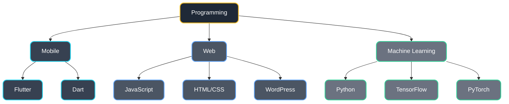
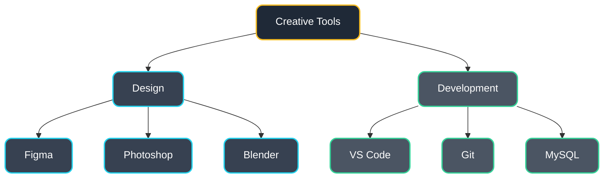

<h1 align="center">Hi, I'm Nakul Dev 👋</h1>
<h3 align="center">Flutter | React | ML Enthusiast</h3>

<div align="center">
<br>
    
[](https://nakuldevmv.github.io/)
[](https://instagram.com/jo.cly.n)
[](https://linkedin.com/in/nakuldevmv)
[](mailto:nakuldevmv@gmail.com)
[](https://nakuldevmv.github.io/Resume/resume.pdf)


</div>
<br>

```typescript
class Developer {
    name: string = "Nakul Dev";
    role: string = "(Flutter | React) Developer";
    location: string = "India";
    workingOn: string = "FindX";
    learning: string[] = ["Flutter", "React", "Machine Learning"];
    askMeAbout: string[] = ["Web Dev", "App Dev", "ML", "UI/UX"];
}
```

## 💻 Technical Skills



## 🎨 Design & Tools



## 📊 GitHub Stats

<div align="center">
  
  &nbsp;&nbsp;
  
</div>


#
<div align="center">
  <i>Always learning, always growing. Feel free to reach out!</i>
</div>
