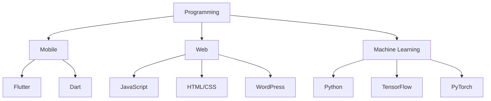
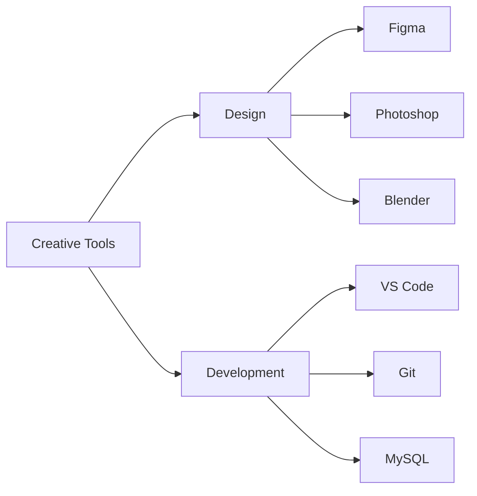

<h1 align="center">Hi, I'm Nakul Dev 👋</h1>
<h3 align="center">Flutter Developer | ML Enthusiast</h3>

<div align="center">

[](https://nakuldevmv.github.io/)
[](https://linkedin.com/in/nakuldevmv)
[](mailto:nakuldev1561@gmail.com)

</div>

```typescript
class Developer {
    name: string = "Nakul Dev";
    role: string = "Flutter Developer";
    location: string = "India";
    workingOn: string = "Portfolio Website";
    learning: string[] = ["Flutter", "Machine Learning"];
    askMeAbout: string[] = ["App Dev", "ML", "UI/UX"];
}
```

## 💻 Technical Skills



## 🎨 Design & Tools



## 📊 GitHub Stats

<div align="center">
  
  &nbsp;&nbsp;
  
</div>

## 🤝 Connect With Me

<div align="center">

[](https://linkedin.com/in/nakuldevmv)
[](https://instagram.com/jo.cly.n)
[](https://www.hackerrank.com/nakuldev1561)
[](https://www.leetcode.com/nakuldev1561)

</div>

---

<div align="center">
  <i>Always learning, always growing. Feel free to reach out!</i>
</div>
